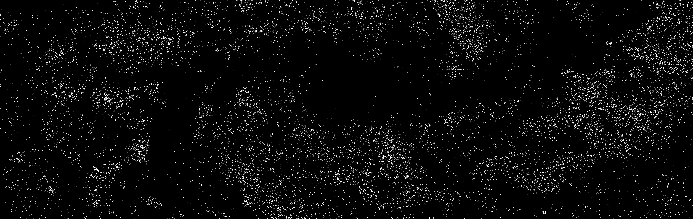
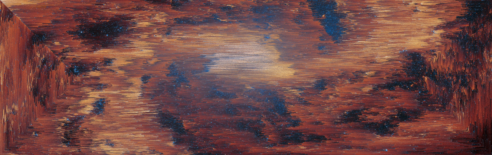
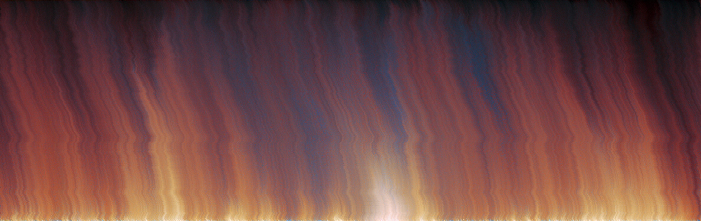
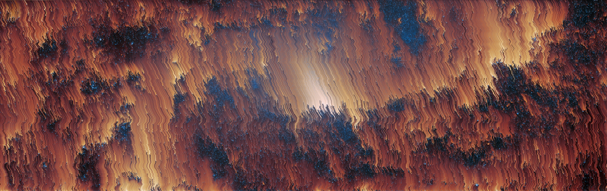

# pixorder


pixelsorter cli written in golang

rewritten from my nodejs implementation, which used [satyarth/pixelsort](https://github.com/satyarth/pixelsort/) as reference

furst time using go, might be cursed

## features
- row, spiral, and seam carving patterns
- shuffle pixels, sort in waves, random lengths, or smear instead
- sort by lightness, hue, saturation, and r/g/b
- sort with a mask
- sort multiple images in parallel
- sort in reverse
- rotation

## wanted features
- even more patterns
  - https://github.com/satyarth/pixelsort/issues/30
- completion? im lazy

## install
### from source
```sh
git clone https://github.com/0xf0xx0/pixorder.git
cd pixorder
go build
# now `mv pixorder`, or
go install
```

## examples/usage
**Original**
 - [src: ESA/Webb, NASA & CSA, A. Adamo (Stockholm University) and the FEAST JWST team](https://esawebb.org/images/potm2310a/)

**Mask**


**Row sort w/ default options**
`pixorder --input ~/Downloads/potm2310a.jpg --output ./examples/webb-row.jpg`


**Row sort w/ threshold**
`pixorder --input ~/Downloads/potm2310a.jpg --lower_threshold 0.3 --upper_threshold 0.6 --output ./examples/webb-row-thresh.jpg`


**Row sort w/ default options & mask**
`pixorder --input ~/Downloads/potm2310a.jpg --mask ./examples/webb-mask.jpg --output ./examples/webb-row-masked.jpg`


**Spiral sort w/ default options**
`pixorder --input ~/Downloads/potm2310a.jpg --pattern spiral --output ./examples/webb-spiral.jpg`


**Spiral sort using most options & mask**
`pixorder --input ~/Downloads/potm2310a.jpg --mask ./examples/webb-mask.jpg --pattern spiral --interval wave --randomness 0.4 --comparator saturation --section_length 400 --output ./examples/webb-spiral-masked.jpg`


**Seam sort w/ default options**
`pixorder --input ~/Downloads/potm2310a.jpg --pattern seam --output ./examples/webb-seam.jpg`


**Seam sort w/ default options & mask**
`pixorder --input ~/Downloads/potm2310a.jpg --mask ./examples/webb-mask.jpg --pattern seam --output ./examples/webb-seam-masked.jpg`


did you know webb and hubble pics are cc4?

## "benchmark"
done with [hyperfine](https://github.com/sharkdp/hyperfine), so it's super legit now right? \
src img is the "large jpg" dl from [esawebb.org](https://esawebb.org/images/potm2310a/) \
`hyperfine -w 3 -c "rm -v ./benchmark" "pixorder -i ~/Downloads/potm2310a.jpg -o ./benchmark" "pixorder -i ~/Downloads/potm2310a.jpg -m ./examples/webb-mask.jpg -o ./benchmark" --export-markdown -`
| Command | Mean [s] | Min [s] | Max [s] | Relative |
|:---|---:|---:|---:|---:|
| `pixorder -i ~/Downloads/potm2310a.jpg -o ./benchmark` | 2.716 ± 0.013 | 2.690 | 2.734 | 1.31 ± 0.02 |
| `pixorder -i ~/Downloads/potm2310a.jpg -m ./examples/webb-mask.jpg -o ./benchmark` | 2.074 ± 0.032 | 2.032 | 2.126 | 1.00 |
